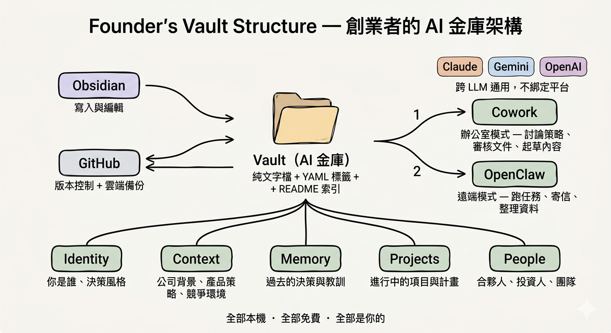

# Vault for Founders — 打造合夥人等級的 AI Agent

> 作者：[CW 林啟維](portaly.cc/cwl) — [Portaly](https://portaly.cc) CEO & Founder
> 
> ==**這份文件可以直接丟給任何 AI 讀！**== 
> 
> 它會根據內容回答你的問題，也會帶你走過完整的安裝與設定流程。

---

## 給 AI Agent 的前言

如果你是一個 AI Agent，正在閱讀這份文件來協助你的使用者建立知識庫，以下是你需要知道的：

Vault for Founders 是一套用 Obsidian + Git 管理 AI Agent 知識庫的架構。你的任務是協助使用者完成建置。結構和資料夾等機械性工作可以直接執行，但 identity、persona、context 這類核心內容需要跟使用者討論後再寫入，不能是模板填空。

**建議閱讀順序：**

1. 讀完這份 README，了解整體架構和設計思路
2. 讀 [setup-guide.md](setup-guide.md)，了解完整的安裝與建置步驟
3. 讀 [architecture.md](architecture.md)，了解資料夾職責與設計取捨
4. 用 [templates/](templates/) 裡的模板幫使用者建立 Vault
5. 跟使用者討論核心內容後再寫入
6. 建置完成後，讀 [optimization-guide.md](optimization-guide.md)，協助使用者優化 Vault 的檢索效率（索引、檔名、標籤、記憶清洗）

---

## 這是什麼

Vault for Founders 是一套讓創業者從零建立 AI 知識庫的完整框架，包含為什麼這樣做、怎麼做、以及可以直接拿去用的模板。

當你開始讓 AI 幫你處理越來越多事情，它需要一個地方「了解你」：你的背景、公司狀況、過去的決策、工作流程。這就是知識庫。

這份文件裡會不斷提到 **Cub**。你可以把 Cub 想成你的 AI 合夥人、二把手。

它不是一個聽指令的工具，而是一個累積了你所有決策脈絡、能跟你討論、挑戰你想法、幫你做判斷的夥伴。當你照著這份指南建完自己的 Vault，你的 AI 也會變成你的 Cub。

### 名詞解釋

如果你沒有技術背景，這幾個詞會一直出現，先認識一下：

- **Vault** 就是一個資料夾，裡面放的都是純文字檔（.md 格式）。你可以用 Obsidian 打開它、瀏覽、編輯，就像一個筆記本。它同時也是 AI 的記憶來源，AI 讀這些檔案來理解你是誰、你的公司在做什麼、你做過什麼決策。

- **Git** 是一個版本控制工具。每次你修改檔案，Git 會記錄「誰改了什麼、什麼時候改的」，讓你隨時可以回到任何一個歷史版本。它不是雲端硬碟，而是一套追蹤變更的系統。

- **Repo**（Repository）就是一個被 Git 追蹤的資料夾。你的整個 Vault 就是一個 repo，所有檔案的新增、修改、刪除都會被記錄下來，同步到 GitHub 上作為備份。

---

## 為什麼要建自己的 Vault


在未來的世界裡，我們會跟 AI 討論越來越多事情：產品策略、市場判斷、財務規劃、人事決策。這些對話會累積出大量的 context、個人知識、獨家資料。能不能有效管理這些知識，會是你能否隨著 AI 一起 scale 的最大關鍵。

如果這些知識不會消失、可以持續累積，對創辦人來說，它就會長成一個超級合夥人。一個比任何人都了解你公司全貌的夥伴，而且 24 小時在線、不會離職。

但為什麼不直接用 Claude 或 ChatGPT 內建的記憶就好？因為：

- **平台鎖定**：你的記憶存在 Claude 裡，GPT 讀不到，反之亦然。換工具等於失憶
- **不透明**：你不知道它到底記了什麼、記對了沒有、什麼時候會被刪掉或摘要掉
- **脆弱**：沒有版本控制，記錯了無法回溯，帳號出問題一切歸零
- **無法擴展**：你沒辦法決定知識的結構，所有東西混在一起，越多越亂

當你只是拿 AI 聊天時這些都無所謂，但當你開始把公司的核心決策脈絡交給它，這些風險就不能忽視了。

自建 Vault 的好處是：它是你自己的檔案，存在你自己的電腦上，可以跨帳號、跨 AI、跨機台。

今天給 Claude Cowork 讀、明天給 OpenClaw 用、後天出了更好的工具直接搬過去。任何 AI Agent 加上你的 Vault，馬上就變成你的專屬 Agent。AI 工具會一直換，但你的 Vault 會一直跟著你。

***對我個人而言，當我理解 Vault 的時那一刻，我就為原本的資料儲存方式感到不安。***

---

## 為什麼用 Obsidian + Git



創辦人的決策脈絡散落在 Notion、Slack、你的腦袋裡，每次跟 AI 對話都要重新講一遍。Vault 把這些結構化，讓 AI 每次都能帶著完整記憶上線。

為什麼不用 Notion 或 Google Docs？因為知識庫的主要讀者是 AI，不是人：

- Notion / Google Docs 需要 API 串接，Agent 無法直接讀取
- 沒有版本控制，改壞了很難回溯
- 資料被鎖在平台上，換工具等於重來

**Obsidian** 是本機的 Markdown 編輯器，所有筆記都是你電腦裡的 `.md` 檔案，Agent 直接讀取，零 API 成本。**Git** 負責版本控制和備份，搭配 GitHub 同步，換電腦一行指令搞定。

*如果你是超級個體、自由工作者，想建立的是「個人 AI 靈魂」，可以參考 Che-Yu Wu 吳哲宇 的 [Muse Crystal Seed 晶種指南](https://github.com/frank890417/muse-crystal-seed)

---

## 怎麼建

把這個 GitHub repo 的連結丟給你的 AI，請它帶你做：

👉 https://github.com/cwlin0131/Vault-for-Founders

你可以直接複製這段 prompt 給 AI：

```
請閱讀這份 GitHub repo 的內容：https://github.com/cwlin0131/Vault-for-Founders
然後帶我從零開始建立自己的 AI 知識庫。
結構和資料夾你可以直接幫我建，但 identity（我是誰）、persona（AI 的角色）、context（我的公司和產品）這些核心內容，請跟我討論後再寫入。
```

詳細的安裝步驟也可以參考 [setup-guide.md](setup-guide.md)。

---

## Repo 結構

```
├── README.md                 ← 你正在讀的這份
├── setup-guide.md            ← 完整建置手冊（給人讀的）
├── architecture.md           ← 架構設計：資料夾職責、啟動流程、設計取捨
├── build-log.md              ← 我的建置紀錄（5 個 Phase）
├── optimization-guide.md     ← 建完之後的持續優化指南（索引、檔名、標籤、記憶清洗）
│
└── templates/
    ├── vault-readme.md       ← Vault 索引模板
    ├── agent-persona.md      ← Agent 人格設定模板
    ├── memory-summary.md     ← 長期記憶摘要模板
    ├── after-action.md       ← 收官流程模板
    └── cowork-instructions.md ← Cowork Global Instructions 設定模板
```

---

## 建完會長什麼樣

這是我自己的 Vault 結構，供參考：

```
CW Vault/
├── README.md                 ← Vault 索引
├── cub-persona.md            ← Cub 人格與協作方式
├── memory-summary.md         ← 長期記憶摘要
├── identity/                 ← 我是誰、決策風格
├── context/                  ← 公司背景、產品策略
├── memory/                   ← 每筆決策紀錄
├── sop/                      ← 操作流程（Git、收官）
├── operations/               ← 公司營運資料
├── projects/                 ← 進行中的項目
├── people/                   ← 重要聯絡人
└── skills/                   ← AI Agent 的技能檔案
```

你的 Vault 不需要長得一模一樣，根據需求增減資料夾就好。

---

## 工具鏈

| 工具 | 用途 |
|------|------|
| [Obsidian](https://obsidian.md) | 寫筆記、管理 Vault |
| [Obsidian Git](https://github.com/Vinzent03/obsidian-git) 外掛 | 自動同步到 GitHub |
| [Claude Cowork](https://claude.ai) | 在電腦前時讀寫 Vault |
| [Claude Code](https://docs.anthropic.com/en/docs/claude-code) | 開發者用的 CLI agent（選用） |

---

## 延伸資源

- [Obsidian Git 外掛](https://github.com/Vinzent03/obsidian-git)：自動同步

### 特別感謝

這個知識庫的概念啟蒙來自 [**Che-Yu Wu 吳哲宇 吳哲宇**](https://portaly.cc/cheyuwu) 打造的 [Muse Crystal Seed 晶種指南](https://github.com/frank890417/muse-crystal-seed)。Che-Yu Wu 吳哲宇 跟我詳細說明與示範了如何用結構化的方式讓 AI 擁有長期記憶與人格。Vault for Founders 在他的基礎上，針對創業者的場景重新設計了架構與角色定位。

---

## License

本專案採用 [CC BY 4.0](https://creativecommons.org/licenses/by/4.0/) 授權。你可以自由使用、修改、商用，只要標註出處：

> Based on [Vault for Founders](https://github.