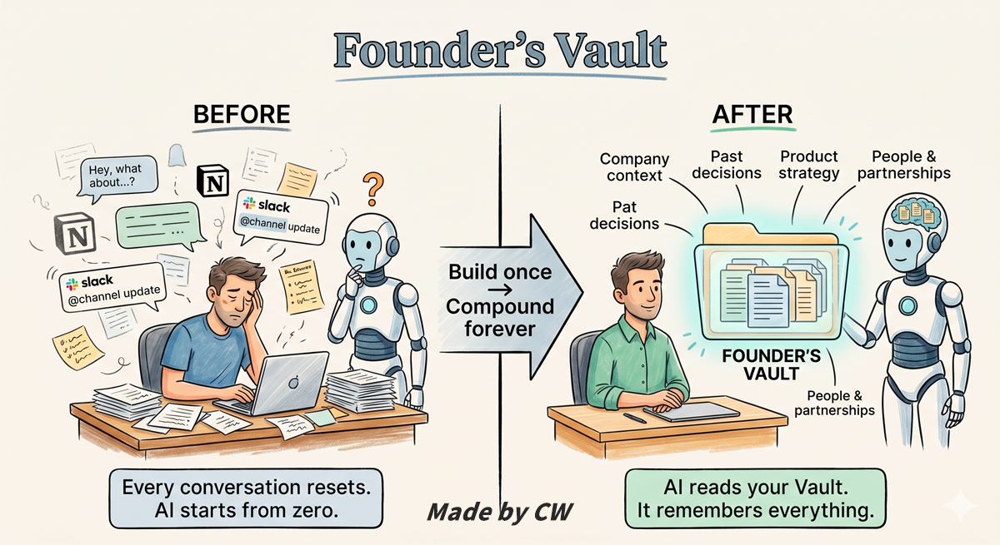
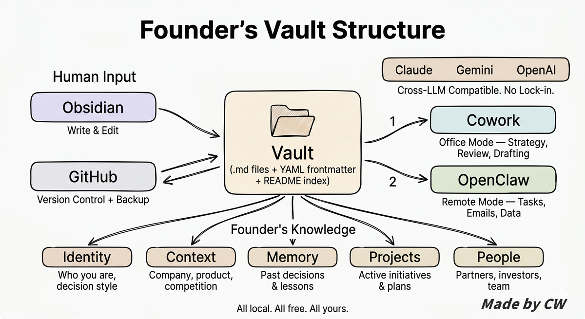

# Vault for Founders — Build a Cofounder-Level AI Agent

> By [CW Lin](https://portaly.cc/cwl) — CEO & Founder of [Portaly](https://portaly.cc)
> 
> **You can hand this entire document to any AI and it will guide you through setup.**

---

## For AI Agents

If you're an AI Agent reading this to help a user build their knowledge base:

Vault for Founders is a framework for managing an AI Agent's knowledge base using Obsidian + Git. Your job is to help the user set it up. Folder structures and scaffolding can be done directly, but core content like identity, persona, and context must be discussed with the user first — no template fill-in-the-blanks.

**Suggested reading order:**

1. Read this README for the overall architecture and philosophy
2. Read [setup-guide.md](setup-guide.md) for step-by-step installation
3. Read [architecture.md](architecture.md) for design decisions and trade-offs
4. Use [templates/](templates/) to scaffold the user's Vault
5. Discuss core content with the user before writing it
6. After setup, read [optimization-guide.md](optimization-guide.md) to help the user optimize retrieval efficiency (indexing, naming, tagging, memory cleanup)

---

## What Is This

Vault for Founders is a complete framework for founders to build an AI knowledge base from scratch — including why, how, and ready-to-use templates.

As you start delegating more to AI — product strategy, market analysis, financial planning, hiring decisions — it needs a place to "know you": your background, your company, your past decisions, your workflows. That place is your Vault.

Throughout this guide, we'll refer to **Cub** — think of it as your AI cofounder, your second-in-command.

It's not a tool that follows instructions. It's a partner that accumulates all your decision context, discusses ideas with you, challenges your thinking, and helps you make better calls. When you finish building your Vault, your AI becomes your Cub.

### Key Terms

If you don't have a technical background, here are a few terms that come up frequently:

- **Vault** is just a folder containing plain text files (.md format). You can open it in Obsidian to browse and edit, like a notebook. It's also the AI's memory source — the AI reads these files to understand who you are, what your company does, and what decisions you've made.

- **Git** is a version control tool. Every time you modify a file, Git records who changed what and when, so you can always go back to any previous version. It's not cloud storage — it's a change tracking system.

- **Repo** (Repository) is a folder tracked by Git. Your entire Vault is a repo — every file addition, edit, and deletion is recorded and synced to GitHub as a backup.

---

## Why Build Your Own Vault



In the near future, we'll discuss increasingly important things with AI: product strategy, market bets, financial planning, people decisions. These conversations generate massive amounts of context, personal knowledge, and proprietary data. Whether you can effectively manage this knowledge determines whether you can scale alongside AI.

If this knowledge never disappears and keeps compounding, it grows into a super-cofounder for you — a partner that understands your entire company better than anyone, available 24/7, and never quits.

So why not just use Claude or ChatGPT's built-in memory? Because:

- **Platform lock-in**: Your memory lives in Claude, GPT can't read it, and vice versa. Switching tools means starting from zero
- **Opaque**: You don't know what it actually remembers, whether it's accurate, or when it gets deleted or summarized away
- **Fragile**: No version control — if it gets something wrong, you can't roll back. Account issues wipe everything
- **Can't scale**: You can't decide how knowledge is structured. Everything gets mixed together, and more means messier

When you're just chatting with AI, none of this matters. But when you start entrusting it with your company's core decision context, these risks can't be ignored.

The advantage of a self-built Vault: it's your own files, on your own machine, portable across accounts, across AI tools, across devices.

Use it with Claude Cowork today, OpenClaw tomorrow, whatever comes next — just point the new tool at your Vault. AI tools will keep changing, but your Vault stays with you.

---

## Why Obsidian + Git



A founder's decision context is scattered across Notion, Slack, and your own head. Every new AI conversation starts from scratch. A Vault structures all of this so your AI starts every session with full memory.

Why not Notion or Google Docs? Because the primary reader of your knowledge base is AI, not humans:

- Notion / Google Docs require API integrations — Agents can't read them directly
- No version control — hard to roll back mistakes
- Data is locked in the platform — switching tools means starting over

**Obsidian** is a local Markdown editor. All your notes are `.md` files on your computer — Agents read them directly, zero API cost. **Git** handles version control and backup. Paired with GitHub sync, moving to a new machine is one command.

---

## How to Build

Hand this GitHub repo link to your AI and ask it to guide you:

👉 https://github.com/cwlin0131/Vault-for-Founders

You can copy this prompt directly:

```
Read this GitHub repo: https://github.com/cwlin0131/Vault-for-Founders
Then guide me through building my own AI knowledge base from scratch.
You can create the folder structure directly, but for identity (who I am), persona (the AI's role), and context (my company and product), discuss with me before writing anything.
```

For detailed steps, see [setup-guide.md](setup-guide.md).

---

## Repo Structure

```
├── README.md                 ← You're reading this
├── setup-guide.md            ← Complete setup guide
├── architecture.md           ← Architecture design and trade-offs
├── optimization-guide.md     ← Post-setup optimization guide (indexing, naming, tagging, memory cleanup)
│
└── templates/
    ├── vault-readme.md       ← Vault index template
    ├── agent-persona.md      ← Agent persona template
    ├── memory-summary.md     ← Long-term memory summary template
    ├── after-action.md       ← After-action review template
    └── cowork-instructions.md ← Cowork Global Instructions template
```

---

## What It Looks Like When Done

Here's an example Vault structure for reference:

```
Your Vault/
├── README.md                 ← Vault index
├── agent-persona.md          ← Agent persona and collaboration style
├── memory-summary.md         ← Long-term memory summary
├── identity/                 ← Who you are, decision style
├── context/                  ← Company background, product strategy
├── memory/                   ← Decision records
├── sop/                      ← Standard operating procedures
├── operations/               ← Company operations data
├── projects/                 ← Active projects
├── people/                   ← Key contacts
└── skills/                   ← AI Agent skill files
```

Your Vault doesn't need to look exactly like this. Add or remove folders based on your needs.

---

## Tool Stack

| Tool | Purpose |
|------|---------|
| [Obsidian](https://obsidian.md) | Write notes, manage your Vault |
| [Obsidian Git](https://github.com/Vinzent03/obsidian-git) plugin | Auto-sync to GitHub |
| [Claude Cowork](https://claude.ai) | Read/write Vault when at your desk |
| [Claude Code](https://docs.anthropic.com/en/docs/claude-code) | CLI agent for developers (optional) |

---

## Credits

The concept for this knowledge base was inspired by [**Che-Yu Wu**](https://portaly.cc/cheyuwu)'s [Muse Crystal Seed](https://github.com/frank890417/muse-crystal-seed). Che-Yu Wu walked me through how to give AI long-term memory and personality using structured files. Vault for Founders redesigns the architecture and role positioning for the founder use case.

---

## License

Licensed under [CC BY 4.0](https://creativecommons.org/licenses/by/4.0/). Free to use, modify, and commercialize with attribution:

> Based on [Vault for Founders](https://github.com/cwlin0131/Vault-for-Founders) by CW Lin
